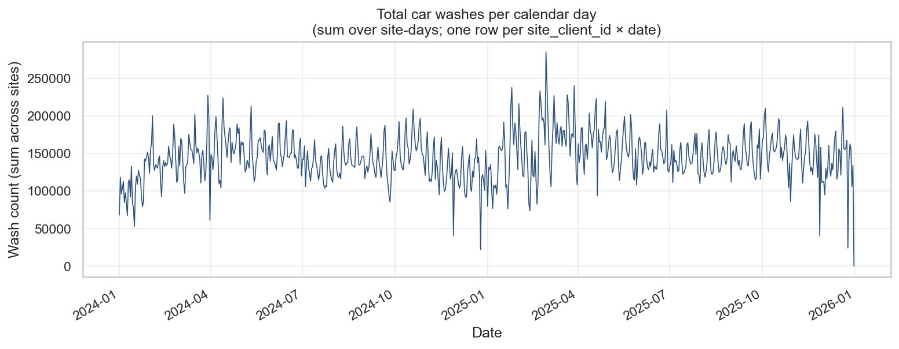
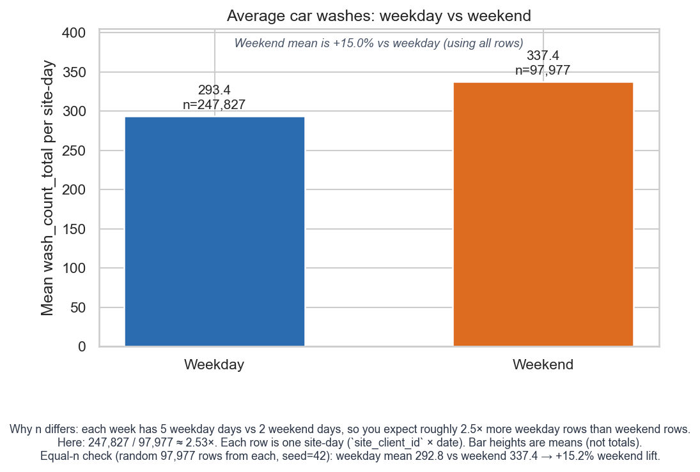
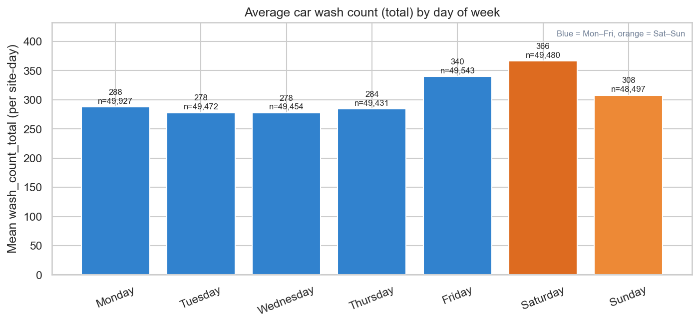
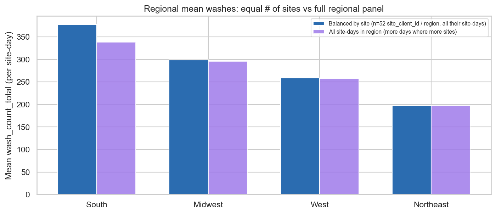
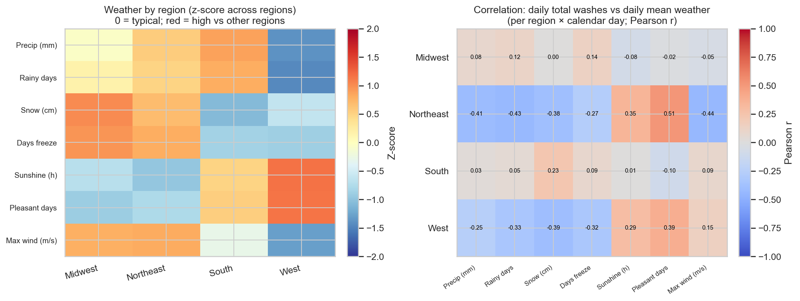
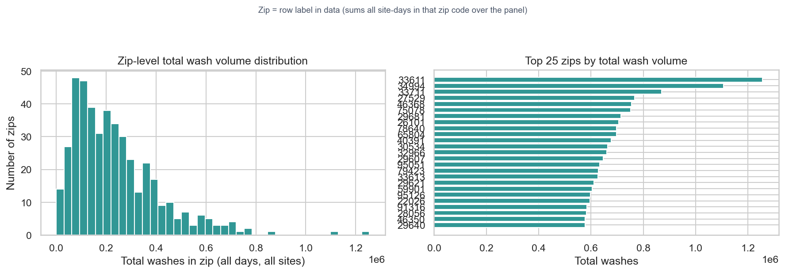
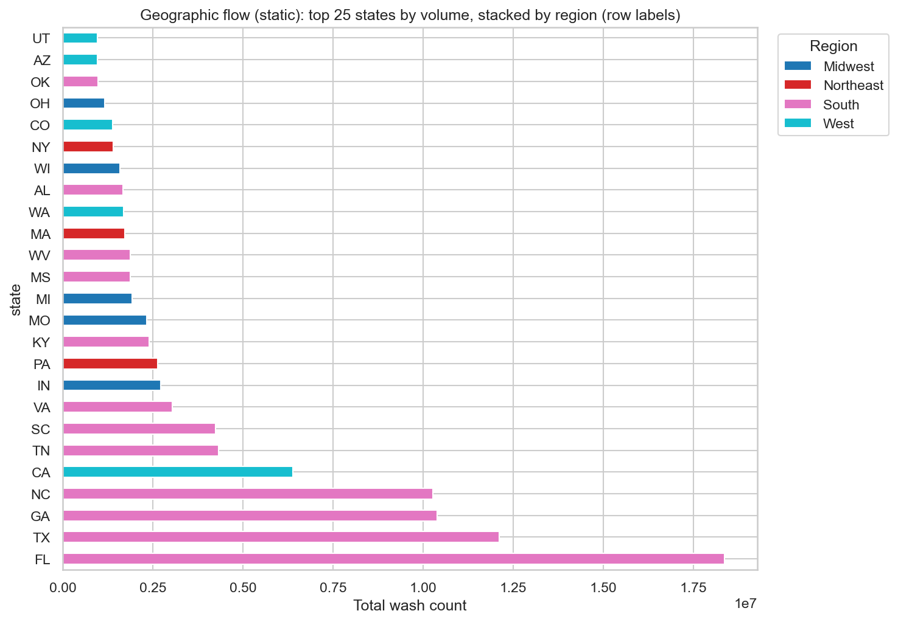
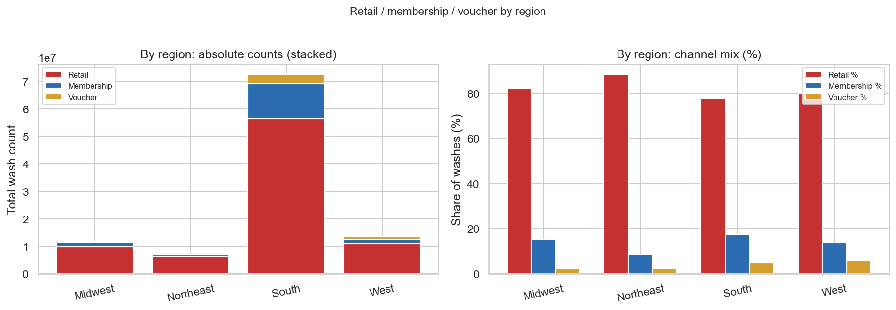
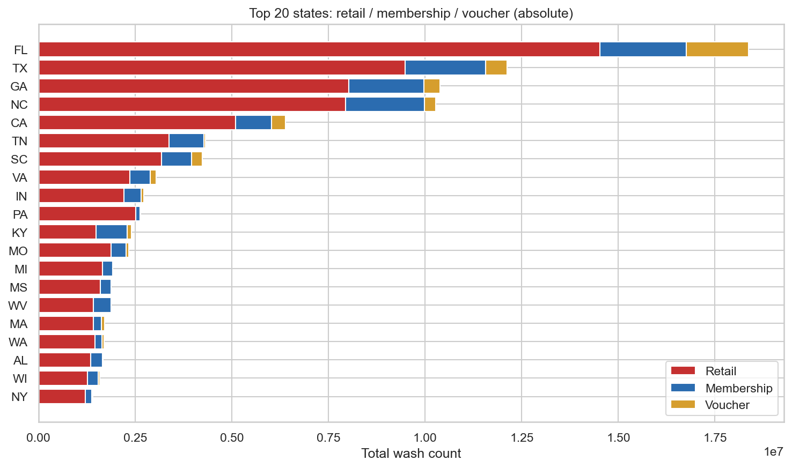
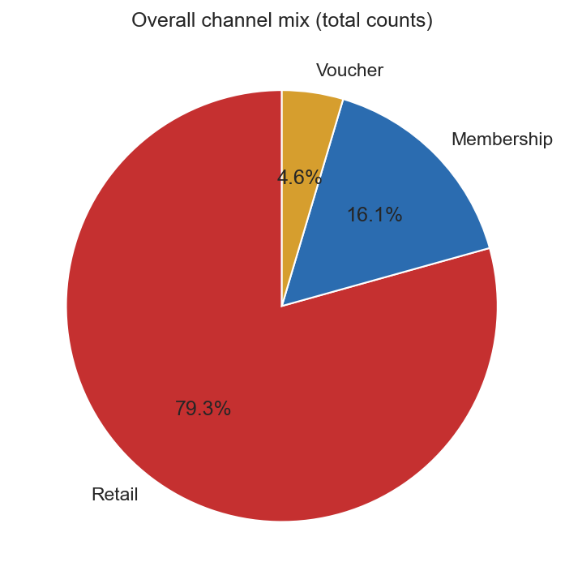

# Car wash exploratory data analysis

**Source data:** `app/site_analysis/modelling/ds/datasets/master_daily_with_site_metadata.csv`  
**Generated:** auto from `run_carwash_eda.py`

## What we measured

- **Day-wise:** sum of `wash_count_total` across all site-days per calendar day.
- **Weekday vs weekend:** mean `wash_count_total` per **site-day** (`site_client_id` × date) (`02_*.png`).
- **By day of week:** same grain for Mon–Sun (`02b_*.png`).
- **Region averages:** **Blue** = random **`site_client_id`** sample with **equal site count per region** (min = Northeast’s site count), mean over all site-days from those sites. **Purple** = mean over **every** site-day row in that region (South has more sites → more rows).
- **Zip distribution:** histogram of total washes by zip and top 25 zips.
- **Sankey:** flow **region → state → city → zip** (`05_sankey_region_state_city_zip.html`). Top cities per state and top zips per city bucket; tails → “Other cities (ST)” / “Other zips (…)”.
- **Channel mix:** `wash_count_retail`, `wash_count_membership`, `wash_count_voucher` by region, top states, and overall.
- **Weather vs washes:** mean weather by region (z-scored heatmap) and **Pearson correlation** of **daily regional total** `wash_count_total` with **mean same-day weather** in that region (`07_*.png`). Not causal (season, mix of sites, shared weather fields).

## Key numbers

- Site-days (rows): **345,804** — one row per **`site_client_id` × `calendar_day`**
- Distinct sites (`site_client_id`): **482**; with non-null `region` on at least one row: **480**
- Distinct `location_id` (chain-style id, not unique per site): **19**
- Date range: **2024-01-01** → **2025-12-31**
- Weekday rows: mean `wash_count_total` **293.42** (n=247,827)
- Weekend rows: mean **337.39** (n=97,977) → **+15.0%** vs weekday mean
- Weekday/weekend row ratio **2.53×** (≈ **5/2** expected from the calendar; see plot 02 footnote + equal-*n* check).

**Mean `wash_count_total` by day of week** (each row = one site-day; see `plots/02b_mean_washes_by_day_of_week.png`):
- **Monday:** 287.66 (n=49,927)
- **Tuesday:** 277.97 (n=49,472)
- **Wednesday:** 277.58 (n=49,454)
- **Thursday:** 284.17 (n=49,431)
- **Friday:** 339.69 (n=49,543)
- **Saturday:** 366.30 (n=49,480)
- **Sunday:** 307.89 (n=48,497)

**Site-balanced regional means** (random **52** `site_client_id` per region, all their site-days; seed=42):
- South: **377.22**
- Midwest: **299.16**
- West: **258.82**
- Northeast: **197.53**

**Sites per region** (from row `region` labels, one region per site):
- South: **299** sites
- West: **73** sites
- Midwest: **56** sites
- Northeast: **52** sites

**Mean over all site-days in region** (more site-days where there are more sites):
- South: **338.44**
- Midwest: **295.58**
- West: **257.01**
- Northeast: **197.53**

**Row counts by region (full data):**
- South: **215,016**
- West: **52,558**
- Midwest: **40,398**
- Northeast: **36,376**

**Overall channel totals:**
- Retail: **83,909,482** (79.3%)
- Membership: **17,010,234** (16.1%)
- Voucher: **4,853,438** (4.6%)

## Findings (brief)

1. **Panel shape:** Each row is **one site-day**: **`site_client_id` × `calendar_day`** (482 sites in this extract). `location_id` is **not** unique per site (many sites share a chain `location_id`). Use **`site_client_id`** (or `client_id` + `location_id`) as the site key.
2. **Day-of-week pattern:** Plot `02b_mean_washes_by_day_of_week.png` (and Key numbers) show **Saturday** and **Friday** as the strongest days on average; **Sunday** is closer to mid-week. The pooled weekend vs weekday bar (`02_avg_washes_weekday_vs_weekend.png`) still shows ~**+15%** weekend lift because **Saturday** pulls the weekend average up. **Unequal weekday/weekend row counts** match the 5:2 calendar; the equal-*n* note on plot 02 checks that lift is not a sample-size artifact.
3. **Regional chart (plot 03):** **Blue** bars equalize **how many sites** enter each region (**52** `site_client_id` per region, seed=42). **Purple** = all site-days in the region. Gaps between blue and purple show when volume/site mix in the full panel differs from an equal-site sample.
4. **Zip concentration:** Total wash volume by zip is long-tailed: a minority of zips drive most counts (see histogram + top-25 bar chart).
5. **Sankey:** Interactive HTML shows **region → state → city → zip**; low-volume cities and zips roll into **Other** buckets so the graph stays readable. Static PNG needs Chrome for Kaleido; use HTML or `05b_*.png` for a simpler regional view.
6. **Channels:** Retail dominates overall (**79.3%** of washes), membership is **16.1%**, vouchers **4.6%**. `06_channel_mix_by_region.png` pairs **absolute** stacked counts (left) with **percent mix** by region (right).
7. **Weather (plot 07):** Left panel compares **average weather** across regions (z-scores so different units share one color scale). Right panel correlates **each region’s daily total washes** (sum of all site-days that day in that region) with **that day’s average weather** in that region. Strong |r| suggests co-movement (often seasonality or market mix), not that weather alone drives volume.

## Zip plots (brief)

- **Left histogram:** How total wash volume is spread across zip codes — most zips are modest; a long tail of **high-volume zips** (dense markets / many site-days).
- **Right bar chart:** The **top 25 zips** by cumulative washes; labels are the zip codes in the data.

## Plots

### Sankey (region → state → zip)

- Interactive Sankey: [open `plots/05_sankey_region_state_city_zip.html`](plots/05_sankey_region_state_city_zip.html) in a browser.

