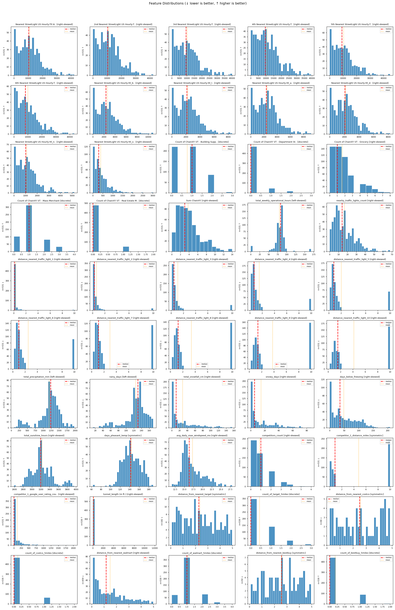

# Site Scoring: Two Approaches

**Context:** We score car wash sites on features (sunshine, traffic, distance to Costco, etc.) by comparing each site to the distribution across all 531 sites. Below are two approaches, what each does, and how they differ.

## Distribution Plots (All Features)

---

## Example: Total Sunshine Hours

**Distribution (531 sites):** min = 2,588 hrs, max = 3,963 hrs, mean ≈ 3,224, median ≈ 3,195, shape = right-skewed. Higher is better.

**Your site: 3,200 hours**

### Approach 1 (Raw Percentile)
- **Rule:** Raw percentile. Higher is better, so score = percentile.
- **Step:** 3,200 ranks at 53.3rd percentile (better than 53.3% of sites).
- **Score:** 53.3
- **Interpretation:** Two options (both for context only; neither changes the score):
  - **Range engine:** Uses data spread and gap points to decide boundaries (e.g. 2,589, 2,750, 2,890, …). Your 3,200 falls in the band between some of these split points.
  - **Category from median/percentile:** Uses percentile bands (e.g. above median, top 25%) to assign labels like "Good (above median)", "Very Good (top 25%)".

### Approach 2 (Shape-Based Binning)
- **Rule:** Shape-based bins. Sunshine is right-skewed → 5 quintile bins.
- **Step:** 3,200 falls in the p40–p60 quintile (between 40th and 60th percentile).
- **Score:** 50 (the score for that quintile)
- **Output:** Bin definitions (p0–p20→5, p20–p40→27.5, p40–p60→50, etc.). Score comes from which bin you fall into, not the raw 53.3.

**Takeaway:** Approach 1 gives 53.3 (exact percentile). Approach 2 gives 50 (bin-based). Values at p41 and p59 would get the same score in Approach 2 (both in p40–p60), but different scores in Approach 1 (41 vs 59).

---

## Summary: What Each Approach Does

| | **Approach 1 (Raw Percentile)** | **Approach 2 (Shape-Based Binning)** |
|---|-------------------------------|-------------------------------------|
| **Name** | Raw Percentile (with two interpretation styles) | Shape-Based Auto Binning |
| **Scoring** | Raw percentile rank | Binned percentile (quintile/decile) |
| **Features** | Config (50) or Auto (50) | Auto (50) |
| **Interpretation** | Range engine (gaps) or category (median/percentile bands) | Shape-driven bins (determine score) |

---

## Approach 1: Raw Percentile (merged)

### Core logic
- **Raw percentile** score (e.g. 53.3) – no binning.
- Same formula for all features: percentile rank, invert if lower is better.
- Config or auto for features and direction.

### Difference in interpretation only

Both interpretation methods are for context only; neither changes the score.

**Interpretation A – Range engine (data spread + gaps):**  
Uses data spread and gap points to decide boundaries. See [Range Engine: How Boundaries Are Found](#range-engine-how-boundaries-are-found) below.

**Interpretation B – Category from median/percentile bands:**  
Uses the median and percentile bands (e.g. top 10%, above median) to assign a category. Labels like "Excellent (top 10%)", "Good (above median)", "Very Good (top 25%)" come from where your percentile sits relative to these fixed bands.

---

## Range Engine: How Boundaries Are Found

Ranges help interpret where a value sits (e.g. "band: 2,890–3,499"). They do **not** affect the score.

### Rules (in order)

| Rule | Condition | Boundaries |
|------|-----------|------------|
| **Discrete** | ≤6 unique values | Ranges = those values (e.g. `[0, 1, 2, 3]`) |
| **Gap-based** | Large gaps in sorted data | Sort all values, take consecutive diffs. 97th percentile of diffs = threshold. Gaps > threshold → split points |
| **Smooth** | No large gaps | None (continuous) |

### Example: `distance_from_nearest_costco`

- **Min:** 0.21 mi · **Max:** 4.85 mi  
- **Rule:** Gap-based (97th pct of diffs → natural breaks)  
- **Split points:** [1.98, 2.83]  
- **Your value 0.5 mi** → falls in band [0.21, 1.98] (closest segment)  
- **Score** comes from percentile (e.g. 89.4), not from this band.

---

## Approach 2: Shape-Based Auto Binning

### What it does
- **Auto-decides bins** from min, max, shape, sample size:
  - Binary (2 values) → 2 bins
  - Discrete (3–6 values) → value buckets
  - Skewed → 5 quintiles
  - Symmetric → 10 deciles
- Score = **which bin** the value falls into (e.g. quintile 3 → 50).

### How it differs
- **vs Approach 1:** Bins affect the score; Approach 1 uses raw percentile. Different scoring logic.

---

## Side-by-Side Comparison

| Aspect | Approach 1 (Raw Percentile) | Approach 2 (Shape-Based) |
|--------|-----------------------------|--------------------------|
| **Scoring formula** | Raw percentile | Binned (quintile/decile) |
| **Interpretation** | Range engine (gaps) or category (median/percentile bands) – neither changes score | Shape-driven bins – determine score |
| **Overall score (same site)** | 50.32 | 54.5 |
